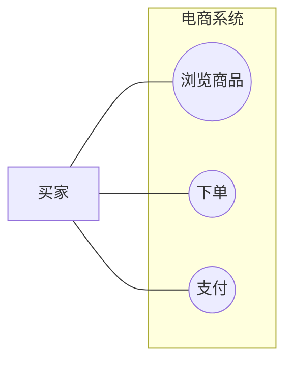
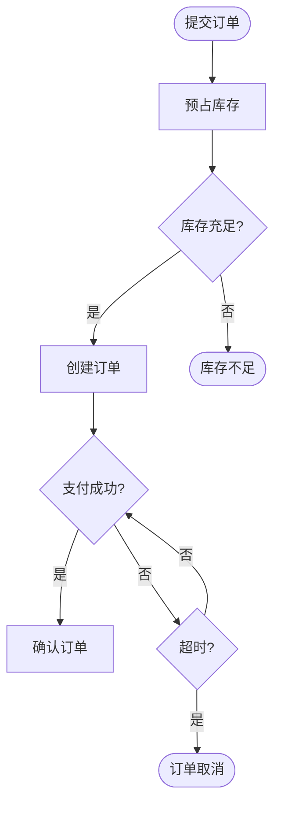
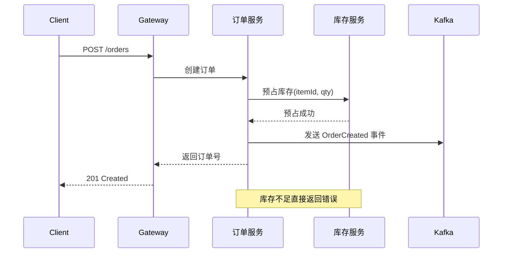
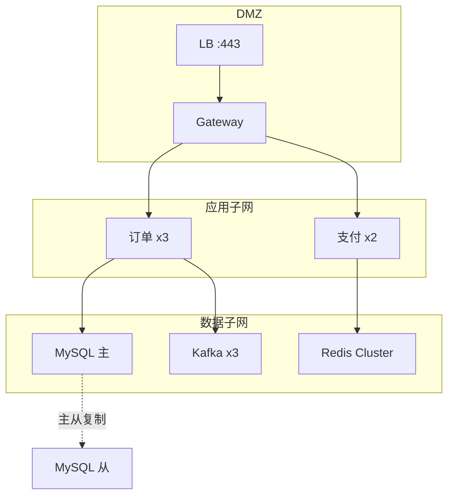
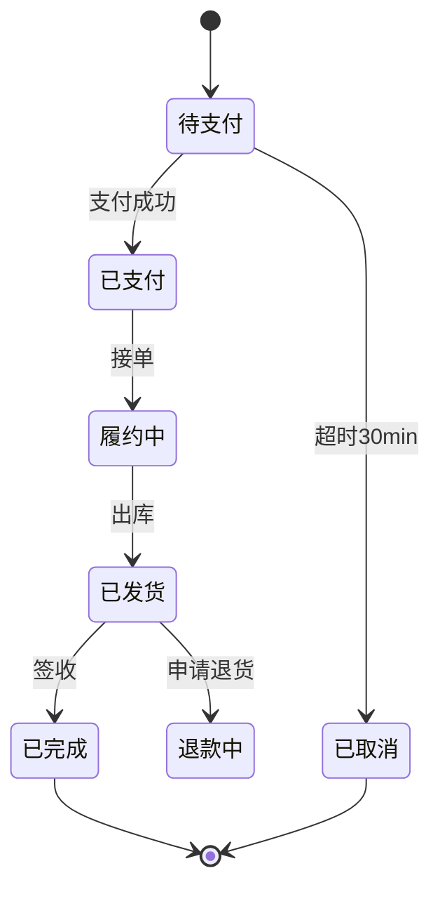

# 软件工程绘图指南

## 概述

画图是工程师的"第二语言"——写代码给机器看，画图给人看。本技能提供：什么场景画什么图、每种图怎么画、架构图的高阶技巧、工具选择与视觉规范。目标是让图成为你的说服力和领导力。

## 场景 → 图种速查

遇到以下场景时，直接查这张表决定该画什么图：

| 场景 | 首选图种 | 配合图种 |
|------|---------|---------|
| 需求澄清 & 用户故事 | 用例图 | 活动图 |
| 业务流程梳理 | 流程图 / 活动图 | 状态图 |
| 接口设计 & 调用链 | 时序图 | — |
| 数据模型设计 | ER 图 | 类图 |
| 领域建模（DDD） | 限界上下文图 | 时序图（验证依赖方向） |
| 架构评审（技术） | 技术治理图 + 核心时序图 | 部署拓扑图 |
| 架构评审（业务） | 全景功能架构图 | — |
| 故障复盘 | 故障传播时序图 | 恢复流程图 |
| 新人 Onboarding | 系统全景图 + 部署拓扑图 | 核心链路时序图 |
| 写技术方案文档 | 4+1 视图套件 | — |

## 图种速查

每种图按：一句话定义 → 何时用 → 核心要素 → 画法步骤 → 常见错误 → Mermaid 模板。

### 用例图

描述"谁"（Actor）能用系统"做什么"（Use Case）。项目启动时与产品对齐功能范围用。

**要素**：Actor（人形/外部系统）、Use Case（椭圆）、系统边界（矩形框）、关联线。

**常见错误**：用例拆太细（"输入用户名"不是一个用例）、用例间连箭头画成流程图。



### 流程图 & 活动图

描述业务或算法中"先做什么、判断什么、再做什么"的执行顺序。

**要素**：开始/结束（圆角）、处理步骤（矩形）、判断（菱形，标注条件）、流向箭头。

**常见错误**：主流程和异常流程混淆、判断节点不标条件、流程线交叉。



### 时序图

描述一次请求中多个参与者按时间顺序发生的消息交互。技术评审、接口设计的核心图种。

**要素**：生命线（垂直虚线）、激活条（矩形）、消息箭头（同步实线、异步虚线）、Note 标注。

**必须标注异常路径**：超时、重试、降级、熔断。



### ER 图

描述数据库层面的实体、属性和关系。数据建模和表结构设计时用。

**要素**：实体（矩形）、属性（列名+类型）、关系（1:1、1:N、N:M）、PK/FK 标注。

**常见错误**：关系全用 N:M（大部分可化简为 1:N）、遗漏外键。

```mermaid
erDiagram
    Order ||--|{ OrderItem : contains
    OrderItem }|--|| Product : references
    Order ||--o{ Payment : "paid by"
    Order { int id PK; string status; decimal total }
    OrderItem { int id PK; int order_id FK; int product_id FK; int quantity }
    Product { int id PK; string name; decimal price }
    Payment { int id PK; int order_id FK; decimal amount; string status }
```

### 部署图 & 拓扑图

描述哪些服务跑在哪些节点上，节点间通过什么协议通信。

**要素**：节点（机器/容器）、组件（服务进程）、通信路径（标注协议+端口）、网络区域（公网/DMZ/内网/DB 子网）。



### 状态图

描述一个对象从创建到消亡的生命周期及状态转移的条件。

**要素**：状态节点（圆角矩形）、转移箭头（标注"事件[条件]/动作"）、初始态（实心圆）、终态（实心圆+外圈）。



## 架构图三大黄金法则

### 铁律一：视图分离——看人下菜

没有一张图能讲清楚所有事情。先想清楚谁在看图：

- **给老板/产品/业务看** → 全景功能架构图。只写业务能力名称，不出现 Kafka/Redis/Saga/ACL。方框里是业务名词，用颜色区分核心域/支撑域/通用域。
- **给架构师/开发/测试看** → 技术治理图 + 核心链路时序图。必须有 Pipeline 推进感、治理层（事务/防资损）、SRE 保障层（熔断/限流/DLQ）。时序图必须标注异常路径。
- **给 DDD 建模团队看** → 限界上下文图。只画圈和连线，标注 ACL/领域事件/上下游关系。

### 铁律二：动静结合，不要画"死图"

- **静态方块**：定义职责与边界（"谁是谁"）。
- **动态流水线**：引入时间线/生命周期回答"然后呢"。在架构图底部加一条横向箭头写明核心生命周期，用虚线与上方功能方块关联。

### 铁律三：在图上表达架构决策

- **收敛态势**：要推广的模块放在图中枢位置，让上下游形成向心力。
- **防腐隔离（ACL）**：用颜色或虚线框明确标出"脏数据区"和"纯净标准域"。
- **容错补偿**：底层标出 Saga、DLQ、降级策略，连线旁注释"当 X 熔断时降级为 Y"。
- **非功能需求标注**：连线标 P99 < 50ms、节点标 4C8G x3、虚线标故障切换路径 RTO < 5min。

## 六种实战场景的组合策略

### 向上汇报（1 张图）
全景功能架构图。横向分层、纵向分域。只写业务名词。可选"改造前后对比"。

### 技术评审（4 张图）
技术治理图 + 核心链路时序图（1-2 张） + 对账/补偿流程图 + 部署拓扑图。

### DDD 领域建模（3 张图）
限界上下文图 + 关键场景时序图（2-3 张，验证依赖方向）+ 可选核心内部类图。

### 故障复盘（3 张图）
故障传播时序图（红色标故障点 + 标出响应时间变化）+ 恢复流程图 + 改进措施对照表。

### 新人 Onboarding（3 张图）
系统全景图 + 核心链路时序图 + 部署拓扑图（标环境地址、日志查看方式）。

### 写设计文档（4+1 视图）
逻辑视图（类图）+ 进程视图（时序图）+ 物理视图（部署图）+ 开发视图（组件图）+ 场景视图（用例图+核心时序图）。小需求 2-3 张即可。

## 工具选型

| 场景 | 推荐工具 |
|------|---------|
| Markdown 文档内嵌图 | Mermaid（原生 GitHub/GitLab 渲染） |
| CI 集成 / 自动化 | PlantUML 或 Mermaid |
| 快速画草图/想法 | Excalidraw |
| 正式架构评审 | Draw.io 或 ProcessOn |
| 团队协作 | FigJam 或 Lucidchart |

**核心原则**：代码驱动画"规范型"的图（时序图/ER/状态图，语法严格），拖拽工具画"表达型"的图（架构图，需要自由排布）。

## 视觉规范

- **三色原则**：浅蓝（通用域）、浅绿（支撑域）、浅橙/浅红（核心域）。主色调 ≤3 种。
- **粗细线条**：普通调用细灰线（#999, 1px）、主执行轴粗彩线（3-4px）、异常降级用虚线。
- **图例强制**：右上/下角必须有框标明颜色含义 + 线型含义 + 特殊符号。
- **标注让图有用**：连线标接口名（如 `OrderCreated`），节点标 QPS/资源规格，DB 旁标容量。

## 反模式（必须避免）

1. **用技术架构图向老板汇报** — 立刻迷路。
2. **时序图只画正常流程** — 不标超时/重试/降级等于没画。
3. **用一张图解释一切** — 一张图只解决一个视角。
4. **类图画成全部属性和方法的大全** — 高亮关键结构即可。
5. **图文不一致** — 改代码不改图的架构文档比没有更危险。

## 与其他技能的配合

- 需要生成 Excalidraw 图时，把此处确定的图种和结构交给 `excalidraw-diagram` 技能执行。
- 涉及架构评审和方案文档时，本技能的"场景→图种"结论可作为 `brainstorming` 和 `writing-plans` 的设计输入。
